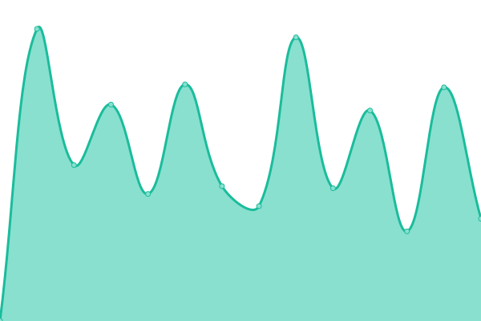

# [📈 Live Status](https://symapex.github.io/upsite): <!--live status--> **🟩 All systems operational**

This repository contains the open-source uptime monitor and status page for [symapex](https://symapex.github.io/upsite), powered by [Upptime](https://github.com/upptime/upptime).

With [Upptime](https://upptime.js.org), you can get your own unlimited and free uptime monitor and status page, powered entirely by a GitHub repository. We use [Issues](https://github.com/symapex/upsite/issues) as incident reports, [Actions](https://github.com/symapex/upsite/actions) as uptime monitors, and [Pages](https://symapex.github.io/upsite) for the status page.

<!--start: status pages-->
<!-- This summary is generated by Upptime (https://github.com/upptime/upptime) -->
<!-- Do not edit this manually, your changes will be overwritten -->
<!-- prettier-ignore -->
| URL | Status | History | Response Time | Uptime |
| --- | ------ | ------- | ------------- | ------ |
|  [Landscapers Fortworth](https://landscapersfortworth.com/) | 🟩 Up | [landscapers-fortworth.yml](https://github.com/symapex/upsite/commits/HEAD/history/landscapers-fortworth.yml) | 

 553ms
     
 | 

<a href="https://symapex.github.io/upsite/history/landscapers-fortworth">100.00%</a>
    

|  [Landscapers Oakland](https://landscapersoakland.com/) | 🟩 Up | [landscapers-oakland.yml](https://github.com/symapex/upsite/commits/HEAD/history/landscapers-oakland.yml) | 

 588ms
     
 | 

<a href="https://symapex.github.io/upsite/history/landscapers-oakland">100.00%</a>
    

|  [Audiohive](https://audiohivetx.com/) | 🟩 Up | [audiohive.yml](https://github.com/symapex/upsite/commits/HEAD/history/audiohive.yml) | 

 443ms
     
 | 

<a href="https://symapex.github.io/upsite/history/audiohive">100.00%</a>
    

|  [Sound Phonic](https://soundphonicca.com/) | 🟩 Up | [sound-phonic.yml](https://github.com/symapex/upsite/commits/HEAD/history/sound-phonic.yml) | 

 465ms
     
 | 

<a href="https://symapex.github.io/upsite/history/sound-phonic">100.00%</a>
    

|  [Bitztream](https://bitztreamnc.com/) | 🟩 Up | [bitztream.yml](https://github.com/symapex/upsite/commits/HEAD/history/bitztream.yml) | 

 403ms
     
 | 

<a href="https://symapex.github.io/upsite/history/bitztream">100.00%</a>
    

|  [Audio Rific](https://audiorificma.com/) | 🟩 Up | [audio-rific.yml](https://github.com/symapex/upsite/commits/HEAD/history/audio-rific.yml) | 

 450ms
     
 | 

<a href="https://symapex.github.io/upsite/history/audio-rific">100.00%</a>
    

|  [Boosted Audio](https://boostedaudioor.com/) | 🟩 Up | [boosted-audio.yml](https://github.com/symapex/upsite/commits/HEAD/history/boosted-audio.yml) | 

 509ms
     
 | 

<a href="https://symapex.github.io/upsite/history/boosted-audio">100.00%</a>
    

|  [Audio Watch](https://audiowatchor.com/) | 🟩 Up | [audio-watch.yml](https://github.com/symapex/upsite/commits/HEAD/history/audio-watch.yml) | 

 483ms
     
 | 

<a href="https://symapex.github.io/upsite/history/audio-watch">100.00%</a>
    

|  [Meat Market Phoenix](https://meatmarketphoenix.com/) | 🟩 Up | [meat-market-phoenix.yml](https://github.com/symapex/upsite/commits/HEAD/history/meat-market-phoenix.yml) | 

 526ms
     
 | 

<a href="https://symapex.github.io/upsite/history/meat-market-phoenix">100.00%</a>
    

|  [Steel Cradle Phoenix](https://steelcradlephoenix.com/) | 🟩 Up | [steel-cradle-phoenix.yml](https://github.com/symapex/upsite/commits/HEAD/history/steel-cradle-phoenix.yml) | 

 808ms
     
 | 

<a href="https://symapex.github.io/upsite/history/steel-cradle-phoenix">100.00%</a>
    

|  [Restorativ Phoenix](https://restorativ-phoenix.com/) | 🟩 Up | [restorativ-phoenix.yml](https://github.com/symapex/upsite/commits/HEAD/history/restorativ-phoenix.yml) | 

 472ms
     
 | 

<a href="https://symapex.github.io/upsite/history/restorativ-phoenix">100.00%</a>
    

|  [House Glitz Nashville](https://houseglitznashville.com/) | 🟩 Up | [house-glitz-nashville.yml](https://github.com/symapex/upsite/commits/HEAD/history/house-glitz-nashville.yml) | 

 498ms
     
 | 

<a href="https://symapex.github.io/upsite/history/house-glitz-nashville">100.00%</a>
    

|  [Flagstone Santa Ana](https://flagstonesantaana.com/) | 🟩 Up | [flagstone-santa-ana.yml](https://github.com/symapex/upsite/commits/HEAD/history/flagstone-santa-ana.yml) | 

 483ms
     
 | 

<a href="https://symapex.github.io/upsite/history/flagstone-santa-ana">100.00%</a>
    

|  [Rock Rough Phoenix](https://rockroughphoenix.com/) | 🟩 Up | [rock-rough-phoenix.yml](https://github.com/symapex/upsite/commits/HEAD/history/rock-rough-phoenix.yml) | 

 566ms
     
 | 

<a href="https://symapex.github.io/upsite/history/rock-rough-phoenix">100.00%</a>
    

|  [Gooyer Well Repairs](https://gooyerwellrepairsomaha.com/) | 🟩 Up | [gooyer-well-repairs.yml](https://github.com/symapex/upsite/commits/HEAD/history/gooyer-well-repairs.yml) | 

 504ms
     
 | 

<a href="https://symapex.github.io/upsite/history/gooyer-well-repairs">100.00%</a>
    

|  [Fenrails Tampa](https://fenrails-tampa.com/) | 🟩 Up | [fenrails-tampa.yml](https://github.com/symapex/upsite/commits/HEAD/history/fenrails-tampa.yml) | 

 430ms
     
 | 

<a href="https://symapex.github.io/upsite/history/fenrails-tampa">100.00%</a>
    

|  [Ace Windows Henderson](https://acewindowshenderson.com/) | 🟩 Up | [ace-windows-henderson.yml](https://github.com/symapex/upsite/commits/HEAD/history/ace-windows-henderson.yml) | 

 1568ms
     
 | 

<a href="https://symapex.github.io/upsite/history/ace-windows-henderson">100.00%</a>
    

|  [Fortres Doors Oakland](https://fortressdoorsoakland.com/) | 🟩 Up | [fortres-doors-oakland.yml](https://github.com/symapex/upsite/commits/HEAD/history/fortres-doors-oakland.yml) | 

 578ms
     
 | 

<a href="https://symapex.github.io/upsite/history/fortres-doors-oakland">100.00%</a>
    

|  [Bugbuster Austin](https://bugbusteraustin.com/) | 🟩 Up | [bugbuster-austin.yml](https://github.com/symapex/upsite/commits/HEAD/history/bugbuster-austin.yml) | 

 1564ms
     
 | 

<a href="https://symapex.github.io/upsite/history/bugbuster-austin">100.00%</a>
    

|  [The Flooring Guys Phoenix](https://theflooringguysphoenix.com/) | 🟩 Up | [the-flooring-guys-phoenix.yml](https://github.com/symapex/upsite/commits/HEAD/history/the-flooring-guys-phoenix.yml) | 

 466ms
     
 | 

<a href="https://symapex.github.io/upsite/history/the-flooring-guys-phoenix">100.00%</a>
    

|  [Advise Pilot Cincinnati](https://advisepilotcincinnati.com/) | 🟩 Up | [advise-pilot-cincinnati.yml](https://github.com/symapex/upsite/commits/HEAD/history/advise-pilot-cincinnati.yml) | 

 458ms
     
 | 

<a href="https://symapex.github.io/upsite/history/advise-pilot-cincinnati">100.00%</a>
    

|  [Audio Key Kansas](https://audiokeykansas.com/) | 🟩 Up | [audio-key-kansas.yml](https://github.com/symapex/upsite/commits/HEAD/history/audio-key-kansas.yml) | 

 528ms
     
 | 

<a href="https://symapex.github.io/upsite/history/audio-key-kansas">100.00%</a>
    

|  [Audio Loom Sandiego](https://audioloomsandiego.com/) | 🟩 Up | [audio-loom-sandiego.yml](https://github.com/symapex/upsite/commits/HEAD/history/audio-loom-sandiego.yml) | 

 507ms
     
 | 

<a href="https://symapex.github.io/upsite/history/audio-loom-sandiego">100.00%</a>
    

|  [Cinematron Los Angeles](https://cinematronlosangeles.com/) | 🟩 Up | [cinematron-los-angeles.yml](https://github.com/symapex/upsite/commits/HEAD/history/cinematron-los-angeles.yml) | 

 425ms
     
 | 

<a href="https://symapex.github.io/upsite/history/cinematron-los-angeles">100.00%</a>
    

|  [Landary Charlotte](https://landarycharlotte.com/) | 🟩 Up | [landary-charlotte.yml](https://github.com/symapex/upsite/commits/HEAD/history/landary-charlotte.yml) | 

 706ms
     
 | 

<a href="https://symapex.github.io/upsite/history/landary-charlotte">100.00%</a>
    

|  [Masonly Stockton](https://masonlystockton.com/) | 🟩 Up | [masonly-stockton.yml](https://github.com/symapex/upsite/commits/HEAD/history/masonly-stockton.yml) | 

 466ms
     
 | 

<a href="https://symapex.github.io/upsite/history/masonly-stockton">100.00%</a>
    

|  [Staff Mobile Cincinnati](https://staffmobilecincinnati.com/) | 🟩 Up | [staff-mobile-cincinnati.yml](https://github.com/symapex/upsite/commits/HEAD/history/staff-mobile-cincinnati.yml) | 

 466ms
     
 | 

<a href="https://symapex.github.io/upsite/history/staff-mobile-cincinnati">100.00%</a>
    

|  [Steel Croft Phoenix](https://steelcroftphoenix.com/) | 🟩 Up | [steel-croft-phoenix.yml](https://github.com/symapex/upsite/commits/HEAD/history/steel-croft-phoenix.yml) | 

 506ms
     
 | 

<a href="https://symapex.github.io/upsite/history/steel-croft-phoenix">100.00%</a>
    

|  [Telephoniq Las Vegas](https://telephoniqlasvegas.com/) | 🟩 Up | [telephoniq-las-vegas.yml](https://github.com/symapex/upsite/commits/HEAD/history/telephoniq-las-vegas.yml) | 

 447ms
     
 | 

<a href="https://symapex.github.io/upsite/history/telephoniq-las-vegas">100.00%</a>
    

|  [Translatium Houston](https://translatium-houston.com/) | 🟩 Up | [translatium-houston.yml](https://github.com/symapex/upsite/commits/HEAD/history/translatium-houston.yml) | 

 529ms
     
 | 

<a href="https://symapex.github.io/upsite/history/translatium-houston">100.00%</a>
    

|  [Martinez Garcia Law](https://martinezgarcialawmiami.com/) | 🟩 Up | [martinez-garcia-law.yml](https://github.com/symapex/upsite/commits/HEAD/history/martinez-garcia-law.yml) | 

 536ms
     
 | 

<a href="https://symapex.github.io/upsite/history/martinez-garcia-law">100.00%</a>
    

|  [Class Deck Miami](https://classdeckmiami.com/) | 🟩 Up | [class-deck-miami.yml](https://github.com/symapex/upsite/commits/HEAD/history/class-deck-miami.yml) | 

 525ms
     
 | 

<a href="https://symapex.github.io/upsite/history/class-deck-miami">100.00%</a>
    

|  [Local Arquitectos Miami](https://localarquitectosmiami.com/) | 🟩 Up | [local-arquitectos-miami.yml](https://github.com/symapex/upsite/commits/HEAD/history/local-arquitectos-miami.yml) | 

 575ms
     
 | 

<a href="https://symapex.github.io/upsite/history/local-arquitectos-miami">100.00%</a>
    

|  [Notario Publico San Antonio](https://notariopublicosanantonio.com/) | 🟩 Up | [notario-publico-san-antonio.yml](https://github.com/symapex/upsite/commits/HEAD/history/notario-publico-san-antonio.yml) | 

 363ms
     
 | 

<a href="https://symapex.github.io/upsite/history/notario-publico-san-antonio">100.00%</a>
    

|  [Ingles Genie San Antonio](https://inglesgeniesanantonio.com/) | 🟩 Up | [ingles-genie-san-antonio.yml](https://github.com/symapex/upsite/commits/HEAD/history/ingles-genie-san-antonio.yml) | 

 477ms
     
 | 

<a href="https://symapex.github.io/upsite/history/ingles-genie-san-antonio">100.00%</a>
    

|  [Arquitecto San Antonio](https://arquitectosanantonio.com/) | 🟩 Up | [arquitecto-san-antonio.yml](https://github.com/symapex/upsite/commits/HEAD/history/arquitecto-san-antonio.yml) | 

 511ms
     
 | 

<a href="https://symapex.github.io/upsite/history/arquitecto-san-antonio">100.00%</a>
    

|  [English Mill Phoenix](https://englishmillphoenix.com/) | 🟩 Up | [english-mill-phoenix.yml](https://github.com/symapex/upsite/commits/HEAD/history/english-mill-phoenix.yml) | 

 454ms
     
 | 

<a href="https://symapex.github.io/upsite/history/english-mill-phoenix">100.00%</a>
    

|  [Arquitecto Phoenix](https://arquitectophoenix.com/) | 🟩 Up | [arquitecto-phoenix.yml](https://github.com/symapex/upsite/commits/HEAD/history/arquitecto-phoenix.yml) | 

 420ms
     
 | 

<a href="https://symapex.github.io/upsite/history/arquitecto-phoenix">100.00%</a>
    

|  [Arquitecto Houston](https://arquitectohouston.com/) | 🟩 Up | [arquitecto-houston.yml](https://github.com/symapex/upsite/commits/HEAD/history/arquitecto-houston.yml) | 

 1380ms
     
 | 

<a href="https://symapex.github.io/upsite/history/arquitecto-houston">100.00%</a>
    

|  [Lab Fluent Houston](https://labfluenthouston.com/) | 🟩 Up | [lab-fluent-houston.yml](https://github.com/symapex/upsite/commits/HEAD/history/lab-fluent-houston.yml) | 

 358ms
     
 | 

<a href="https://symapex.github.io/upsite/history/lab-fluent-houston">100.00%</a>
    

|  [Cinemusbend](https://cinemusbend.com/) | 🟩 Up | [cinemusbend.yml](https://github.com/symapex/upsite/commits/HEAD/history/cinemusbend.yml) | 

 515ms
     
 | 

<a href="https://symapex.github.io/upsite/history/cinemusbend">100.00%</a>
    

|  [Real Time Digital Kansas](https://realtimedigitalkansas.com/) | 🟩 Up | [real-time-digital-kansas.yml](https://github.com/symapex/upsite/commits/HEAD/history/real-time-digital-kansas.yml) | 

 506ms
     
 | 

<a href="https://symapex.github.io/upsite/history/real-time-digital-kansas">100.00%</a>
    

|  [Willar Translation Tampa](https://willartranslationtampa.com/) | 🟩 Up | [willar-translation-tampa.yml](https://github.com/symapex/upsite/commits/HEAD/history/willar-translation-tampa.yml) | 

 537ms
     
 | 

<a href="https://symapex.github.io/upsite/history/willar-translation-tampa">100.00%</a>
    

|  [Tidy Culture Mesa](https://tidyculturemesa.com/) | 🟩 Up | [tidy-culture-mesa.yml](https://github.com/symapex/upsite/commits/HEAD/history/tidy-culture-mesa.yml) | 

 437ms
     
 | 

<a href="https://symapex.github.io/upsite/history/tidy-culture-mesa">100.00%</a>
    

|  [Phone Bolt Colorado](https://phoneboltcolorado.com/) | 🟩 Up | [phone-bolt-colorado.yml](https://github.com/symapex/upsite/commits/HEAD/history/phone-bolt-colorado.yml) | 

 530ms
     
 | 

<a href="https://symapex.github.io/upsite/history/phone-bolt-colorado">100.00%</a>
    

|  [Phone Start Systems](https://phonestartsystems.com/) | 🟩 Up | [phone-start-systems.yml](https://github.com/symapex/upsite/commits/HEAD/history/phone-start-systems.yml) | 

 349ms
     
 | 

<a href="https://symapex.github.io/upsite/history/phone-start-systems">100.00%</a>
    

|  [Welly Repairs](https://wellyrepairs.com/) | 🟩 Up | [welly-repairs.yml](https://github.com/symapex/upsite/commits/HEAD/history/welly-repairs.yml) | 

 479ms
     
 | 

<a href="https://symapex.github.io/upsite/history/welly-repairs">100.00%</a>
    

|  [Home Flix Chill](https://homeflixchill.com/) | 🟩 Up | [home-flix-chill.yml](https://github.com/symapex/upsite/commits/HEAD/history/home-flix-chill.yml) | 

 480ms
     
 | 

<a href="https://symapex.github.io/upsite/history/home-flix-chill">100.00%</a>
    

|  [Steel Grade Tusk](https://steelgradetusk.com/) | 🟩 Up | [steel-grade-tusk.yml](https://github.com/symapex/upsite/commits/HEAD/history/steel-grade-tusk.yml) | 

 432ms
     
 | 

<a href="https://symapex.github.io/upsite/history/steel-grade-tusk">100.00%</a>
    

|  [Miami Home Cinema](https://miamihomecinema.com/) | 🟩 Up | [miami-home-cinema.yml](https://github.com/symapex/upsite/commits/HEAD/history/miami-home-cinema.yml) | 

 415ms
     
 | 

<a href="https://symapex.github.io/upsite/history/miami-home-cinema">100.00%</a>
    

|  [Floor Bright Cleaning](https://floorbrightcleaning.com/) | 🟩 Up | [floor-bright-cleaning.yml](https://github.com/symapex/upsite/commits/HEAD/history/floor-bright-cleaning.yml) | 

 526ms
     
 | 

<a href="https://symapex.github.io/upsite/history/floor-bright-cleaning">100.00%</a>
    

|  [Accel Translate](https://accel-translate.com/) | 🟩 Up | [accel-translate.yml](https://github.com/symapex/upsite/commits/HEAD/history/accel-translate.yml) | 

 513ms
     
 | 

<a href="https://symapex.github.io/upsite/history/accel-translate">100.00%</a>
    

|  [Grand Tunity](https://grandtunity.com/) | 🟩 Up | [grand-tunity.yml](https://github.com/symapex/upsite/commits/HEAD/history/grand-tunity.yml) | 

 405ms
     
 | 

<a href="https://symapex.github.io/upsite/history/grand-tunity">100.00%</a>
    

|  [Piano Precision](https://piano-precision.com/) | 🟩 Up | [piano-precision.yml](https://github.com/symapex/upsite/commits/HEAD/history/piano-precision.yml) | 

 466ms
     
 | 

<a href="https://symapex.github.io/upsite/history/piano-precision">100.00%</a>
    

|  [Syncphony Seattle](https://syncphonyseattle.com/) | 🟩 Up | [syncphony-seattle.yml](https://github.com/symapex/upsite/commits/HEAD/history/syncphony-seattle.yml) | 

 377ms
     
 | 

<a href="https://symapex.github.io/upsite/history/syncphony-seattle">100.00%</a>
    

|  [Seattle Magnitune](https://seattlemagnitune.com/) | 🟩 Up | [seattle-magnitune.yml](https://github.com/symapex/upsite/commits/HEAD/history/seattle-magnitune.yml) | 

 507ms
     
 | 

<a href="https://symapex.github.io/upsite/history/seattle-magnitune">100.00%</a>
    

|  [Key Tuning Seattle](https://keytuningseattle.com/) | 🟩 Up | [key-tuning-seattle.yml](https://github.com/symapex/upsite/commits/HEAD/history/key-tuning-seattle.yml) | 

 412ms
     
 | 

<a href="https://symapex.github.io/upsite/history/key-tuning-seattle">100.00%</a>
    

|  [Lawn Workx](https://lawnworkx.com/) | 🟩 Up | [lawn-workx.yml](https://github.com/symapex/upsite/commits/HEAD/history/lawn-workx.yml) | 

 465ms
     
 | 

<a href="https://symapex.github.io/upsite/history/lawn-workx">100.00%</a>
    

|  [Green Turf Professionals](https://greenturfprofessionals.com/) | 🟩 Up | [green-turf-professionals.yml](https://github.com/symapex/upsite/commits/HEAD/history/green-turf-professionals.yml) | 

 402ms
     
 | 

<a href="https://symapex.github.io/upsite/history/green-turf-professionals">100.00%</a>
    

|  [Tree and Lawn](https://treeandlawnco.com/) | 🟩 Up | [tree-and-lawn.yml](https://github.com/symapex/upsite/commits/HEAD/history/tree-and-lawn.yml) | 

 425ms
     
 | 

<a href="https://symapex.github.io/upsite/history/tree-and-lawn">100.00%</a>
    

|  [Garden View Landscapers](https://gardenviewlandscapers.com/) | 🟩 Up | [garden-view-landscapers.yml](https://github.com/symapex/upsite/commits/HEAD/history/garden-view-landscapers.yml) | 

 438ms
     
 | 

<a href="https://symapex.github.io/upsite/history/garden-view-landscapers">100.00%</a>
    

|  [Green View AZ](https://greenviewaz.com/) | 🟩 Up | [green-view-az.yml](https://github.com/symapex/upsite/commits/HEAD/history/green-view-az.yml) | 

 391ms
     
 | 

<a href="https://symapex.github.io/upsite/history/green-view-az">100.00%</a>
    

|  [Landscape Topia](https://landscape-topia.com/) | 🟩 Up | [landscape-topia.yml](https://github.com/symapex/upsite/commits/HEAD/history/landscape-topia.yml) | 

 430ms
     
 | 

<a href="https://symapex.github.io/upsite/history/landscape-topia">100.00%</a>
    

|  [Giveme Green](https://giveme-green.com/) | 🟩 Up | [giveme-green.yml](https://github.com/symapex/upsite/commits/HEAD/history/giveme-green.yml) | 

 572ms
     
 | 

<a href="https://symapex.github.io/upsite/history/giveme-green">100.00%</a>
    

|  [Decor and Scape](https://decorandscape.com/) | 🟩 Up | [decor-and-scape.yml](https://github.com/symapex/upsite/commits/HEAD/history/decor-and-scape.yml) | 

 396ms
     
 | 

<a href="https://symapex.github.io/upsite/history/decor-and-scape">100.00%</a>
    

|  [The Great Gardens](https://thegreatgardens.com/) | 🟩 Up | [the-great-gardens.yml](https://github.com/symapex/upsite/commits/HEAD/history/the-great-gardens.yml) | 

 450ms
     
 | 

<a href="https://symapex.github.io/upsite/history/the-great-gardens">100.00%</a>
    

|  [Environ Work](https://environwork.com/) | 🟩 Up | [environ-work.yml](https://github.com/symapex/upsite/commits/HEAD/history/environ-work.yml) | 

 396ms
     
 | 

<a href="https://symapex.github.io/upsite/history/environ-work">100.00%</a>
    

|  [Concrete Tree](https://concretetree.com/) | 🟩 Up | [concrete-tree.yml](https://github.com/symapex/upsite/commits/HEAD/history/concrete-tree.yml) | 

 485ms
     
 | 

<a href="https://symapex.github.io/upsite/history/concrete-tree">100.00%</a>
    

|  [Bricktically](https://bricktically.com/) | 🟩 Up | [bricktically.yml](https://github.com/symapex/upsite/commits/HEAD/history/bricktically.yml) | 

 505ms
     
 | 

<a href="https://symapex.github.io/upsite/history/bricktically">100.00%</a>
    

|  [Selective Concrete](https://selectiveconcrete.com/) | 🟩 Up | [selective-concrete.yml](https://github.com/symapex/upsite/commits/HEAD/history/selective-concrete.yml) | 

 526ms
     
 | 

<a href="https://symapex.github.io/upsite/history/selective-concrete">100.00%</a>
    

|  [Hard Stack Pro](https://hardstackpro.com/) | 🟩 Up | [hard-stack-pro.yml](https://github.com/symapex/upsite/commits/HEAD/history/hard-stack-pro.yml) | 

 515ms
     
 | 

<a href="https://symapex.github.io/upsite/history/hard-stack-pro">100.00%</a>
    

|  [Concrete Elementz](https://concreteelementz.com/) | 🟩 Up | [concrete-elementz.yml](https://github.com/symapex/upsite/commits/HEAD/history/concrete-elementz.yml) | 

 489ms
     
 | 

<a href="https://symapex.github.io/upsite/history/concrete-elementz">100.00%</a>
    

|  [AZ Brick Frames](https://azbrickframes.com/) | 🟩 Up | [az-brick-frames.yml](https://github.com/symapex/upsite/commits/HEAD/history/az-brick-frames.yml) | 

 499ms
     
 | 

<a href="https://symapex.github.io/upsite/history/az-brick-frames">100.00%</a>
    

|  [Concrete Connected](https://concrete-connected.com/) | 🟩 Up | [concrete-connected.yml](https://github.com/symapex/upsite/commits/HEAD/history/concrete-connected.yml) | 

 498ms
     
 | 

<a href="https://symapex.github.io/upsite/history/concrete-connected">100.00%</a>
    

|  [Brick Zone Works](https://brickzoneworks.com/) | 🟩 Up | [brick-zone-works.yml](https://github.com/symapex/upsite/commits/HEAD/history/brick-zone-works.yml) | 

 543ms
     
 | 

<a href="https://symapex.github.io/upsite/history/brick-zone-works">100.00%</a>
    

|  [Superior Surface](https://superior-surface.com/) | 🟩 Up | [superior-surface.yml](https://github.com/symapex/upsite/commits/HEAD/history/superior-surface.yml) | 

 524ms
     
 | 

<a href="https://symapex.github.io/upsite/history/superior-surface">100.00%</a>
    

|  [Rigid Ground Work](https://rigidgroundwork.com/) | 🟩 Up | [rigid-ground-work.yml](https://github.com/symapex/upsite/commits/HEAD/history/rigid-ground-work.yml) | 

 504ms
     
 | 

<a href="https://symapex.github.io/upsite/history/rigid-ground-work">100.00%</a>
    

|  [The AZ Clean Expert](https://theazcleanexpert.com/) | 🟩 Up | [the-az-clean-expert.yml](https://github.com/symapex/upsite/commits/HEAD/history/the-az-clean-expert.yml) | 

 519ms
     
 | 

<a href="https://symapex.github.io/upsite/history/the-az-clean-expert">100.00%</a>
    

|  [The Weekly Squeaky Clean](https://theweeklysqueakyclean.com/) | 🟩 Up | [the-weekly-squeaky-clean.yml](https://github.com/symapex/upsite/commits/HEAD/history/the-weekly-squeaky-clean.yml) | 

 428ms
     
 | 

<a href="https://symapex.github.io/upsite/history/the-weekly-squeaky-clean">100.00%</a>
    

|  [Sensitive Clean](https://sensitive-clean.com/) | 🟩 Up | [sensitive-clean.yml](https://github.com/symapex/upsite/commits/HEAD/history/sensitive-clean.yml) | 

 418ms
     
 | 

<a href="https://symapex.github.io/upsite/history/sensitive-clean">100.00%</a>
    

|  [Bring Back Clean](https://bringbackclean.com/) | 🟩 Up | [bring-back-clean.yml](https://github.com/symapex/upsite/commits/HEAD/history/bring-back-clean.yml) | 

 504ms
     
 | 

<a href="https://symapex.github.io/upsite/history/bring-back-clean">100.00%</a>
    

|  [Scrubit Clean](https://scrubit-clean.com/) | 🟩 Up | [scrubit-clean.yml](https://github.com/symapex/upsite/commits/HEAD/history/scrubit-clean.yml) | 

 512ms
     
 | 

<a href="https://symapex.github.io/upsite/history/scrubit-clean">100.00%</a>
    

|  [Is Green Scene](https://isgreen-scene.com/) | 🟩 Up | [is-green-scene.yml](https://github.com/symapex/upsite/commits/HEAD/history/is-green-scene.yml) | 

 530ms
     
 | 

<a href="https://symapex.github.io/upsite/history/is-green-scene">100.00%</a>
    

|  [Absolute Landscape Solutions](https://absolutelandscapesolutions.com/) | 🟩 Up | [absolute-landscape-solutions.yml](https://github.com/symapex/upsite/commits/HEAD/history/absolute-landscape-solutions.yml) | 

 402ms
     
 | 

<a href="https://symapex.github.io/upsite/history/absolute-landscape-solutions">100.00%</a>
    

|  [Blooming Pots Landscaping](https://bloomingpotslandscaping.com/) | 🟩 Up | [blooming-pots-landscaping.yml](https://github.com/symapex/upsite/commits/HEAD/history/blooming-pots-landscaping.yml) | 

 518ms
     
 | 

<a href="https://symapex.github.io/upsite/history/blooming-pots-landscaping">100.00%</a>
    

|  [Alpha Landscaping](https://alpha-landscaping.com/) | 🟩 Up | [alpha-landscaping.yml](https://github.com/symapex/upsite/commits/HEAD/history/alpha-landscaping.yml) | 

 522ms
     
 | 

<a href="https://symapex.github.io/upsite/history/alpha-landscaping">100.00%</a>
    

|  [Earth Works Lawn Cares](https://earthworkslawncares.com/) | 🟩 Up | [earth-works-lawn-cares.yml](https://github.com/symapex/upsite/commits/HEAD/history/earth-works-lawn-cares.yml) | 

 381ms
     
 | 

<a href="https://symapex.github.io/upsite/history/earth-works-lawn-cares">100.00%</a>
    

<!--end: status pages-->

[**Visit our status website →**](https://symapex.github.io/upsite)

## 📄 License

- Powered by: [Upptime](https://github.com/upptime/upptime)
- Code: [MIT](./LICENSE) © [symapex](https://symapex.github.io/upsite)
- Data in the `./history` directory: [Open Database License](https://opendatacommons.org/licenses/odbl/1-0/)
