# [📈 Live Status](https://symapex.github.io/upsite): <!--live status--> **🟧 Partial outage**

This repository contains the open-source uptime monitor and status page for [symapex](https://symapex.github.io/upsite), powered by [Upptime](https://github.com/upptime/upptime).

With [Upptime](https://upptime.js.org), you can get your own unlimited and free uptime monitor and status page, powered entirely by a GitHub repository. We use [Issues](https://github.com/symapex/upsite/issues) as incident reports, [Actions](https://github.com/symapex/upsite/actions) as uptime monitors, and [Pages](https://symapex.github.io/upsite) for the status page.

<!--start: status pages-->
<!-- This summary is generated by Upptime (https://github.com/upptime/upptime) -->
<!-- Do not edit this manually, your changes will be overwritten -->
<!-- prettier-ignore -->
| URL | Status | History | Response Time | Uptime |
| --- | ------ | ------- | ------------- | ------ |
|  [Landscapers Fortworth](https://landscapersfortworth.com/) | 🟩 Up | [landscapers-fortworth.yml](https://github.com/symapex/upsite/commits/HEAD/history/landscapers-fortworth.yml) | 

 1835ms
     
 | 

<a href="https://symapex.github.io/upsite/history/landscapers-fortworth">100.00%</a>
    

|  [Aesthetic Landscaping](https://aestheticlandscapingcom.com/) | 🟩 Up | [aesthetic-landscaping.yml](https://github.com/symapex/upsite/commits/HEAD/history/aesthetic-landscaping.yml) | 

 338ms
     
 | 

<a href="https://symapex.github.io/upsite/history/aesthetic-landscaping">100.00%</a>
    

|  [Smart Garden Solutions](https://smartgardensolutions.net/) | 🟩 Up | [smart-garden-solutions.yml](https://github.com/symapex/upsite/commits/HEAD/history/smart-garden-solutions.yml) | 

 349ms
     
 | 

<a href="https://symapex.github.io/upsite/history/smart-garden-solutions">100.00%</a>
    

|  [Green Thumb Landscaping](https://greenthumb-landscape.com/) | 🟩 Up | [green-thumb-landscaping.yml](https://github.com/symapex/upsite/commits/HEAD/history/green-thumb-landscaping.yml) | 

 355ms
     
 | 

<a href="https://symapex.github.io/upsite/history/green-thumb-landscaping">100.00%</a>
    

|  [Lawn Rescue Texas](https://lawnRescuetexas.com/) | 🟩 Up | [lawn-rescue-texas.yml](https://github.com/symapex/upsite/commits/HEAD/history/lawn-rescue-texas.yml) | 

 342ms
     
 | 

<a href="https://symapex.github.io/upsite/history/lawn-rescue-texas">100.00%</a>
    

|  [Landscapers Oakland](https://landscapersoakland.com/) | 🟩 Up | [landscapers-oakland.yml](https://github.com/symapex/upsite/commits/HEAD/history/landscapers-oakland.yml) | 

 456ms
     
 | 

<a href="https://symapex.github.io/upsite/history/landscapers-oakland">100.00%</a>
    

|  [Clean Edge Lawns](https://cleanedgelawns.com/) | 🟩 Up | [clean-edge-lawns.yml](https://github.com/symapex/upsite/commits/HEAD/history/clean-edge-lawns.yml) | 

 309ms
     
 | 

<a href="https://symapex.github.io/upsite/history/clean-edge-lawns">100.00%</a>
    

|  [Control Ground Landscapers](https://controlgroundlandscapers.com/) | 🟩 Up | [control-ground-landscapers.yml](https://github.com/symapex/upsite/commits/HEAD/history/control-ground-landscapers.yml) | 

 344ms
     
 | 

<a href="https://symapex.github.io/upsite/history/control-ground-landscapers">100.00%</a>
    

|  [Great Oakland Landscaping](https://greatoaklandscaping.com/) | 🟩 Up | [great-oakland-landscaping.yml](https://github.com/symapex/upsite/commits/HEAD/history/great-oakland-landscaping.yml) | 

 325ms
     
 | 

<a href="https://symapex.github.io/upsite/history/great-oakland-landscaping">100.00%</a>
    

|  [Wiles Outdoor Lawn Care](https://wilesoutdoorlawncare.com/) | 🟩 Up | [wiles-outdoor-lawn-care.yml](https://github.com/symapex/upsite/commits/HEAD/history/wiles-outdoor-lawn-care.yml) | 

 281ms
     
 | 

<a href="https://symapex.github.io/upsite/history/wiles-outdoor-lawn-care">100.00%</a>
    

|  [Audiohive](https://audiohivetx.com/) | 🟩 Up | [audiohive.yml](https://github.com/symapex/upsite/commits/HEAD/history/audiohive.yml) | 

 914ms
     
 | 

<a href="https://symapex.github.io/upsite/history/audiohive">100.00%</a>
    

|  [Sound Phonic](https://soundphonicca.com/) | 🟩 Up | [sound-phonic.yml](https://github.com/symapex/upsite/commits/HEAD/history/sound-phonic.yml) | 

 343ms
     
 | 

<a href="https://symapex.github.io/upsite/history/sound-phonic">100.00%</a>
    

|  [Bitztream](https://bitztreamnc.com/) | 🟩 Up | [bitztream.yml](https://github.com/symapex/upsite/commits/HEAD/history/bitztream.yml) | 

 376ms
     
 | 

<a href="https://symapex.github.io/upsite/history/bitztream">100.00%</a>
    

|  [Audio Rific](https://audiorificma.com/) | 🟩 Up | [audio-rific.yml](https://github.com/symapex/upsite/commits/HEAD/history/audio-rific.yml) | 

 395ms
     
 | 

<a href="https://symapex.github.io/upsite/history/audio-rific">100.00%</a>
    

|  [Boosted Audio](https://boostedaudioor.com/) | 🟩 Up | [boosted-audio.yml](https://github.com/symapex/upsite/commits/HEAD/history/boosted-audio.yml) | 

 428ms
     
 | 

<a href="https://symapex.github.io/upsite/history/boosted-audio">100.00%</a>
    

|  [Audio Watch](https://audiowatchor.com/) | 🟩 Up | [audio-watch.yml](https://github.com/symapex/upsite/commits/HEAD/history/audio-watch.yml) | 

 388ms
     
 | 

<a href="https://symapex.github.io/upsite/history/audio-watch">100.00%</a>
    

|  [Meat Market Phoenix](https://meatmarketphoenix.com/) | 🟩 Up | [meat-market-phoenix.yml](https://github.com/symapex/upsite/commits/HEAD/history/meat-market-phoenix.yml) | 

 336ms
     
 | 

<a href="https://symapex.github.io/upsite/history/meat-market-phoenix">100.00%</a>
    

|  [Steel Cradle Phoenix](https://steelcradlephoenix.com/) | 🟩 Up | [steel-cradle-phoenix.yml](https://github.com/symapex/upsite/commits/HEAD/history/steel-cradle-phoenix.yml) | 

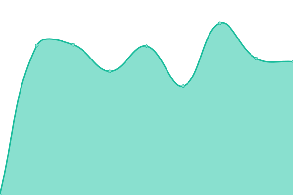 368ms
     
 | 

<a href="https://symapex.github.io/upsite/history/steel-cradle-phoenix">100.00%</a>
    

|  [Restorativ Phoenix](https://restorativ-phoenix.com/) | 🟩 Up | [restorativ-phoenix.yml](https://github.com/symapex/upsite/commits/HEAD/history/restorativ-phoenix.yml) | 

 355ms
     
 | 

<a href="https://symapex.github.io/upsite/history/restorativ-phoenix">100.00%</a>
    

|  [House Glitz Nashville](https://houseglitznashville.com/) | 🟩 Up | [house-glitz-nashville.yml](https://github.com/symapex/upsite/commits/HEAD/history/house-glitz-nashville.yml) | 

 356ms
     
 | 

<a href="https://symapex.github.io/upsite/history/house-glitz-nashville">100.00%</a>
    

|  [Flagstone Santa Ana](https://flagstonesantaana.com/) | 🟩 Up | [flagstone-santa-ana.yml](https://github.com/symapex/upsite/commits/HEAD/history/flagstone-santa-ana.yml) | 

 444ms
     
 | 

<a href="https://symapex.github.io/upsite/history/flagstone-santa-ana">100.00%</a>
    

|  [Rock Rough Phoenix](https://rockroughphoenix.com/) | 🟩 Up | [rock-rough-phoenix.yml](https://github.com/symapex/upsite/commits/HEAD/history/rock-rough-phoenix.yml) | 

 391ms
     
 | 

<a href="https://symapex.github.io/upsite/history/rock-rough-phoenix">100.00%</a>
    

|  [Gooyer Well Repairs](https://gooyerwellrepairsomaha.com/) | 🟩 Up | [gooyer-well-repairs.yml](https://github.com/symapex/upsite/commits/HEAD/history/gooyer-well-repairs.yml) | 

 404ms
     
 | 

<a href="https://symapex.github.io/upsite/history/gooyer-well-repairs">46.78%</a>
    

|  [Fenrails Tampa](https://fenrails-tampa.com/) | 🟩 Up | [fenrails-tampa.yml](https://github.com/symapex/upsite/commits/HEAD/history/fenrails-tampa.yml) | 

 1163ms
     
 | 

<a href="https://symapex.github.io/upsite/history/fenrails-tampa">91.72%</a>
    

|  [Ace Windows Henderson](https://acewindowshenderson.com/) | 🟩 Up | [ace-windows-henderson.yml](https://github.com/symapex/upsite/commits/HEAD/history/ace-windows-henderson.yml) | 

 1227ms
     
 | 

<a href="https://symapex.github.io/upsite/history/ace-windows-henderson">91.83%</a>
    

|  [Fortres Doors Oakland](https://fortressdoorsoakland.com/) | 🟩 Up | [fortres-doors-oakland.yml](https://github.com/symapex/upsite/commits/HEAD/history/fortres-doors-oakland.yml) | 

 447ms
     
 | 

<a href="https://symapex.github.io/upsite/history/fortres-doors-oakland">90.14%</a>
    

|  [Bugbuster Austin](https://bugbusteraustin.com/) | 🟩 Up | [bugbuster-austin.yml](https://github.com/symapex/upsite/commits/HEAD/history/bugbuster-austin.yml) | 

 367ms
     
 | 

<a href="https://symapex.github.io/upsite/history/bugbuster-austin">91.06%</a>
    

|  [The Flooring Guys Phoenix](https://theflooringguysphoenix.com/) | 🟩 Up | [the-flooring-guys-phoenix.yml](https://github.com/symapex/upsite/commits/HEAD/history/the-flooring-guys-phoenix.yml) | 

 378ms
     
 | 

<a href="https://symapex.github.io/upsite/history/the-flooring-guys-phoenix">91.43%</a>
    

|  [Advise Pilot Cincinnati](https://advisepilotcincinnati.com/) | 🟩 Up | [advise-pilot-cincinnati.yml](https://github.com/symapex/upsite/commits/HEAD/history/advise-pilot-cincinnati.yml) | 

 708ms
     
 | 

<a href="https://symapex.github.io/upsite/history/advise-pilot-cincinnati">100.00%</a>
    

|  [Audio Key Kansas](https://audiokeykansas.com/) | 🟩 Up | [audio-key-kansas.yml](https://github.com/symapex/upsite/commits/HEAD/history/audio-key-kansas.yml) | 

 409ms
     
 | 

<a href="https://symapex.github.io/upsite/history/audio-key-kansas">47.04%</a>
    

|  [Audio Loom Sandiego](https://audioloomsandiego.com/) | 🟩 Up | [audio-loom-sandiego.yml](https://github.com/symapex/upsite/commits/HEAD/history/audio-loom-sandiego.yml) | 

 1251ms
     
 | 

<a href="https://symapex.github.io/upsite/history/audio-loom-sandiego">100.00%</a>
    

|  [Cinematron Los Angeles](https://cinematronlosangeles.com/) | 🟩 Up | [cinematron-los-angeles.yml](https://github.com/symapex/upsite/commits/HEAD/history/cinematron-los-angeles.yml) | 

 959ms
     
 | 

<a href="https://symapex.github.io/upsite/history/cinematron-los-angeles">100.00%</a>
    

|  [Landary Charlotte](https://landarycharlotte.com/) | 🟩 Up | [landary-charlotte.yml](https://github.com/symapex/upsite/commits/HEAD/history/landary-charlotte.yml) | 

 331ms
     
 | 

<a href="https://symapex.github.io/upsite/history/landary-charlotte">100.00%</a>
    

|  [Masonly Stockton](https://masonlystockton.com/) | 🟩 Up | [masonly-stockton.yml](https://github.com/symapex/upsite/commits/HEAD/history/masonly-stockton.yml) | 

 329ms
     
 | 

<a href="https://symapex.github.io/upsite/history/masonly-stockton">100.00%</a>
    

|  [Staff Mobile Cincinnati](https://staffmobilecincinnati.com/) | 🟩 Up | [staff-mobile-cincinnati.yml](https://github.com/symapex/upsite/commits/HEAD/history/staff-mobile-cincinnati.yml) | 

 398ms
     
 | 

<a href="https://symapex.github.io/upsite/history/staff-mobile-cincinnati">90.84%</a>
    

|  [Steel Croft Phoenix](https://steelcroftphoenix.com/) | 🟩 Up | [steel-croft-phoenix.yml](https://github.com/symapex/upsite/commits/HEAD/history/steel-croft-phoenix.yml) | 

 359ms
     
 | 

<a href="https://symapex.github.io/upsite/history/steel-croft-phoenix">100.00%</a>
    

|  [Telephoniq Las Vegas](https://telephoniqlasvegas.com/) | 🟩 Up | [telephoniq-las-vegas.yml](https://github.com/symapex/upsite/commits/HEAD/history/telephoniq-las-vegas.yml) | 

 409ms
     
 | 

<a href="https://symapex.github.io/upsite/history/telephoniq-las-vegas">91.44%</a>
    

|  [Translatium Houston](https://translatium-houston.com/) | 🟩 Up | [translatium-houston.yml](https://github.com/symapex/upsite/commits/HEAD/history/translatium-houston.yml) | 

 375ms
     
 | 

<a href="https://symapex.github.io/upsite/history/translatium-houston">91.74%</a>
    

|  [Martinez Garcia Law](https://martinezgarcialawmiami.com/) | 🟩 Up | [martinez-garcia-law.yml](https://github.com/symapex/upsite/commits/HEAD/history/martinez-garcia-law.yml) | 

 860ms
     
 | 

<a href="https://symapex.github.io/upsite/history/martinez-garcia-law">91.45%</a>
    

|  [Class Deck Miami](https://classdeckmiami.com/) | 🟩 Up | [class-deck-miami.yml](https://github.com/symapex/upsite/commits/HEAD/history/class-deck-miami.yml) | 

 1297ms
     
 | 

<a href="https://symapex.github.io/upsite/history/class-deck-miami">90.92%</a>
    

|  [Local Arquitectos Miami](https://localarquitectosmiami.com/) | 🟩 Up | [local-arquitectos-miami.yml](https://github.com/symapex/upsite/commits/HEAD/history/local-arquitectos-miami.yml) | 

 405ms
     
 | 

<a href="https://symapex.github.io/upsite/history/local-arquitectos-miami">90.92%</a>
    

|  [Notario Publico San Antonio](https://notariopublicosanantonio.com/) | 🟩 Up | [notario-publico-san-antonio.yml](https://github.com/symapex/upsite/commits/HEAD/history/notario-publico-san-antonio.yml) | 

 397ms
     
 | 

<a href="https://symapex.github.io/upsite/history/notario-publico-san-antonio">90.93%</a>
    

|  [Ingles Genie San Antonio](https://inglesgeniesanantonio.com/) | 🟩 Up | [ingles-genie-san-antonio.yml](https://github.com/symapex/upsite/commits/HEAD/history/ingles-genie-san-antonio.yml) | 

 993ms
     
 | 

<a href="https://symapex.github.io/upsite/history/ingles-genie-san-antonio">90.20%</a>
    

|  [Arquitecto San Antonio](https://arquitectosanantonio.com/) | 🟩 Up | [arquitecto-san-antonio.yml](https://github.com/symapex/upsite/commits/HEAD/history/arquitecto-san-antonio.yml) | 

 1085ms
     
 | 

<a href="https://symapex.github.io/upsite/history/arquitecto-san-antonio">90.35%</a>
    

|  [English Mill Phoenix](https://englishmillphoenix.com/) | 🟩 Up | [english-mill-phoenix.yml](https://github.com/symapex/upsite/commits/HEAD/history/english-mill-phoenix.yml) | 

 313ms
     
 | 

<a href="https://symapex.github.io/upsite/history/english-mill-phoenix">90.83%</a>
    

|  [Arquitecto Phoenix](https://arquitectophoenix.com/) | 🟩 Up | [arquitecto-phoenix.yml](https://github.com/symapex/upsite/commits/HEAD/history/arquitecto-phoenix.yml) | 

 802ms
     
 | 

<a href="https://symapex.github.io/upsite/history/arquitecto-phoenix">90.36%</a>
    

|  [Arquitecto Houston](https://arquitectohouston.com/) | 🟩 Up | [arquitecto-houston.yml](https://github.com/symapex/upsite/commits/HEAD/history/arquitecto-houston.yml) | 

 340ms
     
 | 

<a href="https://symapex.github.io/upsite/history/arquitecto-houston">90.73%</a>
    

|  [Lab Fluent Houston](https://labfluenthouston.com/) | 🟩 Up | [lab-fluent-houston.yml](https://github.com/symapex/upsite/commits/HEAD/history/lab-fluent-houston.yml) | 

 3145ms
     
 | 

<a href="https://symapex.github.io/upsite/history/lab-fluent-houston">90.63%</a>
    

|  [Cinemusbend](https://cinemusbend.com/) | 🟩 Up | [cinemusbend.yml](https://github.com/symapex/upsite/commits/HEAD/history/cinemusbend.yml) | 

 358ms
     
 | 

<a href="https://symapex.github.io/upsite/history/cinemusbend">100.00%</a>
    

|  [Real Time Digital Kansas](https://realtimedigitalkansas.com/) | 🟩 Up | [real-time-digital-kansas.yml](https://github.com/symapex/upsite/commits/HEAD/history/real-time-digital-kansas.yml) | 

 362ms
     
 | 

<a href="https://symapex.github.io/upsite/history/real-time-digital-kansas">100.00%</a>
    

|  [Willar Translation Tampa](https://willartranslationtampa.com/) | 🟩 Up | [willar-translation-tampa.yml](https://github.com/symapex/upsite/commits/HEAD/history/willar-translation-tampa.yml) | 

 393ms
     
 | 

<a href="https://symapex.github.io/upsite/history/willar-translation-tampa">100.00%</a>
    

|  [Tidy Culture Mesa](https://tidyculturemesa.com/) | 🟩 Up | [tidy-culture-mesa.yml](https://github.com/symapex/upsite/commits/HEAD/history/tidy-culture-mesa.yml) | 

 319ms
     
 | 

<a href="https://symapex.github.io/upsite/history/tidy-culture-mesa">100.00%</a>
    

|  [Phone Bolt Colorado](https://phoneboltcolorado.com/) | 🟩 Up | [phone-bolt-colorado.yml](https://github.com/symapex/upsite/commits/HEAD/history/phone-bolt-colorado.yml) | 

 445ms
     
 | 

<a href="https://symapex.github.io/upsite/history/phone-bolt-colorado">100.00%</a>
    

|  [Phone Start Systems](https://phonestartsystems.com/) | 🟩 Up | [phone-start-systems.yml](https://github.com/symapex/upsite/commits/HEAD/history/phone-start-systems.yml) | 

 333ms
     
 | 

<a href="https://symapex.github.io/upsite/history/phone-start-systems">100.00%</a>
    

|  [Welly Repairs](https://wellyrepairs.com/) | 🟩 Up | [welly-repairs.yml](https://github.com/symapex/upsite/commits/HEAD/history/welly-repairs.yml) | 

 392ms
     
 | 

<a href="https://symapex.github.io/upsite/history/welly-repairs">100.00%</a>
    

|  [Home Flix Chill](https://homeflixchill.com/) | 🟩 Up | [home-flix-chill.yml](https://github.com/symapex/upsite/commits/HEAD/history/home-flix-chill.yml) | 

 319ms
     
 | 

<a href="https://symapex.github.io/upsite/history/home-flix-chill">100.00%</a>
    

|  [Steel Grade Tusk](https://steelgradetusk.com/) | 🟩 Up | [steel-grade-tusk.yml](https://github.com/symapex/upsite/commits/HEAD/history/steel-grade-tusk.yml) | 

 349ms
     
 | 

<a href="https://symapex.github.io/upsite/history/steel-grade-tusk">100.00%</a>
    

|  [Miami Home Cinema](https://miamihomecinema.com/) | 🟩 Up | [miami-home-cinema.yml](https://github.com/symapex/upsite/commits/HEAD/history/miami-home-cinema.yml) | 

 359ms
     
 | 

<a href="https://symapex.github.io/upsite/history/miami-home-cinema">100.00%</a>
    

|  [Floor Bright Cleaning](https://floorbrightcleaning.com/) | 🟩 Up | [floor-bright-cleaning.yml](https://github.com/symapex/upsite/commits/HEAD/history/floor-bright-cleaning.yml) | 

 424ms
     
 | 

<a href="https://symapex.github.io/upsite/history/floor-bright-cleaning">100.00%</a>
    

|  [Accel Translate](https://accel-translate.com/) | 🟩 Up | [accel-translate.yml](https://github.com/symapex/upsite/commits/HEAD/history/accel-translate.yml) | 

 375ms
     
 | 

<a href="https://symapex.github.io/upsite/history/accel-translate">100.00%</a>
    

|  [Grand Tunity](https://grandtunity.com/) | 🟩 Up | [grand-tunity.yml](https://github.com/symapex/upsite/commits/HEAD/history/grand-tunity.yml) | 

 802ms
     
 | 

<a href="https://symapex.github.io/upsite/history/grand-tunity">100.00%</a>
    

|  [Piano Precision](https://piano-precision.com/) | 🟩 Up | [piano-precision.yml](https://github.com/symapex/upsite/commits/HEAD/history/piano-precision.yml) | 

 567ms
     
 | 

<a href="https://symapex.github.io/upsite/history/piano-precision">100.00%</a>
    

|  [Syncphony Seattle](https://syncphonyseattle.com/) | 🟩 Up | [syncphony-seattle.yml](https://github.com/symapex/upsite/commits/HEAD/history/syncphony-seattle.yml) | 

 1153ms
     
 | 

<a href="https://symapex.github.io/upsite/history/syncphony-seattle">100.00%</a>
    

|  [Seattle Magnitune](https://seattlemagnitune.com/) | 🟩 Up | [seattle-magnitune.yml](https://github.com/symapex/upsite/commits/HEAD/history/seattle-magnitune.yml) | 

 294ms
     
 | 

<a href="https://symapex.github.io/upsite/history/seattle-magnitune">100.00%</a>
    

|  [Key Tuning Seattle](https://keytuningseattle.com/) | 🟩 Up | [key-tuning-seattle.yml](https://github.com/symapex/upsite/commits/HEAD/history/key-tuning-seattle.yml) | 

 272ms
     
 | 

<a href="https://symapex.github.io/upsite/history/key-tuning-seattle">100.00%</a>
    

|  [Lawn Workx](https://lawnworkx.com/) | 🟩 Up | [lawn-workx.yml](https://github.com/symapex/upsite/commits/HEAD/history/lawn-workx.yml) | 

 282ms
     
 | 

<a href="https://symapex.github.io/upsite/history/lawn-workx">100.00%</a>
    

|  [Green Turf Professionals](https://greenturfprofessionals.com/) | 🟩 Up | [green-turf-professionals.yml](https://github.com/symapex/upsite/commits/HEAD/history/green-turf-professionals.yml) | 

 278ms
     
 | 

<a href="https://symapex.github.io/upsite/history/green-turf-professionals">100.00%</a>
    

|  [Tree and Lawn](https://treeandlawnco.com/) | 🟩 Up | [tree-and-lawn.yml](https://github.com/symapex/upsite/commits/HEAD/history/tree-and-lawn.yml) | 

 307ms
     
 | 

<a href="https://symapex.github.io/upsite/history/tree-and-lawn">100.00%</a>
    

|  [Garden View Landscapers](https://gardenviewlandscapers.com/) | 🟩 Up | [garden-view-landscapers.yml](https://github.com/symapex/upsite/commits/HEAD/history/garden-view-landscapers.yml) | 

 299ms
     
 | 

<a href="https://symapex.github.io/upsite/history/garden-view-landscapers">100.00%</a>
    

|  [Green View AZ](https://greenviewaz.com/) | 🟩 Up | [green-view-az.yml](https://github.com/symapex/upsite/commits/HEAD/history/green-view-az.yml) | 

 264ms
     
 | 

<a href="https://symapex.github.io/upsite/history/green-view-az">100.00%</a>
    

|  [Landscape Topia](https://landscape-topia.com/) | 🟩 Up | [landscape-topia.yml](https://github.com/symapex/upsite/commits/HEAD/history/landscape-topia.yml) | 

 407ms
     
 | 

<a href="https://symapex.github.io/upsite/history/landscape-topia">100.00%</a>
    

|  [Giveme Green](https://giveme-green.com/) | 🟩 Up | [giveme-green.yml](https://github.com/symapex/upsite/commits/HEAD/history/giveme-green.yml) | 

 353ms
     
 | 

<a href="https://symapex.github.io/upsite/history/giveme-green">100.00%</a>
    

|  [Decor and Scape](https://decorandscape.com/) | 🟩 Up | [decor-and-scape.yml](https://github.com/symapex/upsite/commits/HEAD/history/decor-and-scape.yml) | 

 271ms
     
 | 

<a href="https://symapex.github.io/upsite/history/decor-and-scape">100.00%</a>
    

|  [The Great Gardens](https://thegreatgardens.com/) | 🟩 Up | [the-great-gardens.yml](https://github.com/symapex/upsite/commits/HEAD/history/the-great-gardens.yml) | 

 293ms
     
 | 

<a href="https://symapex.github.io/upsite/history/the-great-gardens">100.00%</a>
    

|  [Environ Work](https://environwork.com/) | 🟩 Up | [environ-work.yml](https://github.com/symapex/upsite/commits/HEAD/history/environ-work.yml) | 

 287ms
     
 | 

<a href="https://symapex.github.io/upsite/history/environ-work">100.00%</a>
    

|  [Concrete Tree](https://concretetree.com/) | 🟩 Up | [concrete-tree.yml](https://github.com/symapex/upsite/commits/HEAD/history/concrete-tree.yml) | 

 305ms
     
 | 

<a href="https://symapex.github.io/upsite/history/concrete-tree">100.00%</a>
    

|  [Bricktically](https://bricktically.com/) | 🟩 Up | [bricktically.yml](https://github.com/symapex/upsite/commits/HEAD/history/bricktically.yml) | 

 320ms
     
 | 

<a href="https://symapex.github.io/upsite/history/bricktically">100.00%</a>
    

|  [Selective Concrete](https://selectiveconcrete.com/) | 🟩 Up | [selective-concrete.yml](https://github.com/symapex/upsite/commits/HEAD/history/selective-concrete.yml) | 

 328ms
     
 | 

<a href="https://symapex.github.io/upsite/history/selective-concrete">100.00%</a>
    

|  [Hard Stack Pro](https://hardstackpro.com/) | 🟩 Up | [hard-stack-pro.yml](https://github.com/symapex/upsite/commits/HEAD/history/hard-stack-pro.yml) | 

 314ms
     
 | 

<a href="https://symapex.github.io/upsite/history/hard-stack-pro">100.00%</a>
    

|  [Concrete Elementz](https://concreteelementz.com/) | 🟩 Up | [concrete-elementz.yml](https://github.com/symapex/upsite/commits/HEAD/history/concrete-elementz.yml) | 

 334ms
     
 | 

<a href="https://symapex.github.io/upsite/history/concrete-elementz">100.00%</a>
    

|  [AZ Brick Frames](https://azbrickframes.com/) | 🟩 Up | [az-brick-frames.yml](https://github.com/symapex/upsite/commits/HEAD/history/az-brick-frames.yml) | 

 329ms
     
 | 

<a href="https://symapex.github.io/upsite/history/az-brick-frames">100.00%</a>
    

|  [Concrete Connected](https://concrete-connected.com/) | 🟩 Up | [concrete-connected.yml](https://github.com/symapex/upsite/commits/HEAD/history/concrete-connected.yml) | 

 324ms
     
 | 

<a href="https://symapex.github.io/upsite/history/concrete-connected">100.00%</a>
    

|  [Brick Zone Works](https://brickzoneworks.com/) | 🟩 Up | [brick-zone-works.yml](https://github.com/symapex/upsite/commits/HEAD/history/brick-zone-works.yml) | 

 335ms
     
 | 

<a href="https://symapex.github.io/upsite/history/brick-zone-works">100.00%</a>
    

|  [Superior Surface](https://superior-surface.com/) | 🟩 Up | [superior-surface.yml](https://github.com/symapex/upsite/commits/HEAD/history/superior-surface.yml) | 

 308ms
     
 | 

<a href="https://symapex.github.io/upsite/history/superior-surface">100.00%</a>
    

|  [Rigid Ground Work](https://rigidgroundwork.com/) | 🟩 Up | [rigid-ground-work.yml](https://github.com/symapex/upsite/commits/HEAD/history/rigid-ground-work.yml) | 

 317ms
     
 | 

<a href="https://symapex.github.io/upsite/history/rigid-ground-work">100.00%</a>
    

|  [The AZ Clean Expert](https://theazcleanexpert.com/) | 🟩 Up | [the-az-clean-expert.yml](https://github.com/symapex/upsite/commits/HEAD/history/the-az-clean-expert.yml) | 

 318ms
     
 | 

<a href="https://symapex.github.io/upsite/history/the-az-clean-expert">100.00%</a>
    

|  [The Weekly Squeaky Clean](https://theweeklysqueakyclean.com/) | 🟩 Up | [the-weekly-squeaky-clean.yml](https://github.com/symapex/upsite/commits/HEAD/history/the-weekly-squeaky-clean.yml) | 

 275ms
     
 | 

<a href="https://symapex.github.io/upsite/history/the-weekly-squeaky-clean">100.00%</a>
    

|  [Sensitive Clean](https://sensitive-clean.com/) | 🟩 Up | [sensitive-clean.yml](https://github.com/symapex/upsite/commits/HEAD/history/sensitive-clean.yml) | 

 260ms
     
 | 

<a href="https://symapex.github.io/upsite/history/sensitive-clean">100.00%</a>
    

|  [Bring Back Clean](https://bringbackclean.com/) | 🟩 Up | [bring-back-clean.yml](https://github.com/symapex/upsite/commits/HEAD/history/bring-back-clean.yml) | 

 324ms
     
 | 

<a href="https://symapex.github.io/upsite/history/bring-back-clean">100.00%</a>
    

|  [Scrubit Clean](https://scrubit-clean.com/) | 🟩 Up | [scrubit-clean.yml](https://github.com/symapex/upsite/commits/HEAD/history/scrubit-clean.yml) | 

 340ms
     
 | 

<a href="https://symapex.github.io/upsite/history/scrubit-clean">100.00%</a>
    

|  [Is Green Scene](https://isgreen-scene.com/) | 🟩 Up | [is-green-scene.yml](https://github.com/symapex/upsite/commits/HEAD/history/is-green-scene.yml) | 

 335ms
     
 | 

<a href="https://symapex.github.io/upsite/history/is-green-scene">100.00%</a>
    

|  [Absolute Landscape Solutions](https://absolutelandscapesolutions.com/) | 🟩 Up | [absolute-landscape-solutions.yml](https://github.com/symapex/upsite/commits/HEAD/history/absolute-landscape-solutions.yml) | 

 260ms
     
 | 

<a href="https://symapex.github.io/upsite/history/absolute-landscape-solutions">100.00%</a>
    

|  [Blooming Pots Landscaping](https://bloomingpotslandscaping.com/) | 🟩 Up | [blooming-pots-landscaping.yml](https://github.com/symapex/upsite/commits/HEAD/history/blooming-pots-landscaping.yml) | 

 326ms
     
 | 

<a href="https://symapex.github.io/upsite/history/blooming-pots-landscaping">100.00%</a>
    

|  [Alpha Landscaping](https://alpha-landscaping.com/) | 🟩 Up | [alpha-landscaping.yml](https://github.com/symapex/upsite/commits/HEAD/history/alpha-landscaping.yml) | 

 337ms
     
 | 

<a href="https://symapex.github.io/upsite/history/alpha-landscaping">100.00%</a>
    

|  [Earth Works Lawn Cares](https://earthworkslawncares.com/) | 🟩 Up | [earth-works-lawn-cares.yml](https://github.com/symapex/upsite/commits/HEAD/history/earth-works-lawn-cares.yml) | 

 273ms
     
 | 

<a href="https://symapex.github.io/upsite/history/earth-works-lawn-cares">100.00%</a>
    

|  [Prism Carpet Cleaning](https://prismcarpetcleaningtx.com/) | 🟩 Up | [prism-carpet-cleaning.yml](https://github.com/symapex/upsite/commits/HEAD/history/prism-carpet-cleaning.yml) | 

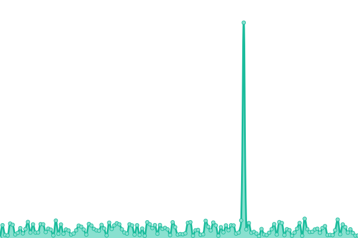 334ms
     
 | 

<a href="https://symapex.github.io/upsite/history/prism-carpet-cleaning">100.00%</a>
    

|  [Get Fence Lab](https://getfencelab.com/) | 🟩 Up | [get-fence-lab.yml](https://github.com/symapex/upsite/commits/HEAD/history/get-fence-lab.yml) | 

 349ms
     
 | 

<a href="https://symapex.github.io/upsite/history/get-fence-lab">100.00%</a>
    

|  [Precise Word AZ](https://precisewordaz.com/) | 🟩 Up | [precise-word-az.yml](https://github.com/symapex/upsite/commits/HEAD/history/precise-word-az.yml) | 

 322ms
     
 | 

<a href="https://symapex.github.io/upsite/history/precise-word-az">100.00%</a>
    

|  [Wellspring Tampa](https://wellspringtampa.com/) | 🟩 Up | [wellspring-tampa.yml](https://github.com/symapex/upsite/commits/HEAD/history/wellspring-tampa.yml) | 

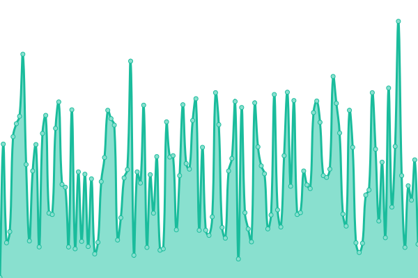 296ms
     
 | 

<a href="https://symapex.github.io/upsite/history/wellspring-tampa">100.00%</a>
    

|  [Tidy Helpers CA](https://tidyhelpersca.com/) | 🟩 Up | [tidy-helpers-ca.yml](https://github.com/symapex/upsite/commits/HEAD/history/tidy-helpers-ca.yml) | 

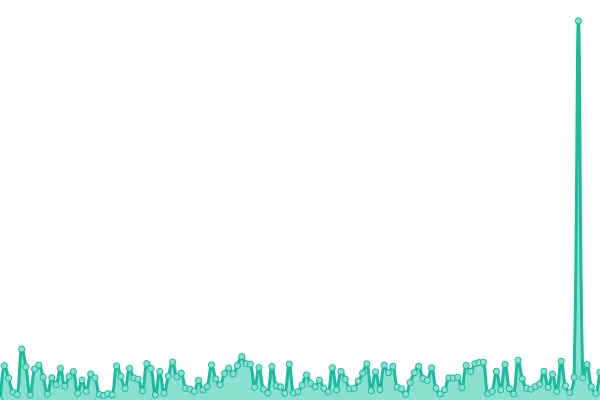 298ms
     
 | 

<a href="https://symapex.github.io/upsite/history/tidy-helpers-ca">100.00%</a>
    

|  [Cleanaholic](https://cleanaholictn.com/) | 🟩 Up | [cleanaholic.yml](https://github.com/symapex/upsite/commits/HEAD/history/cleanaholic.yml) | 

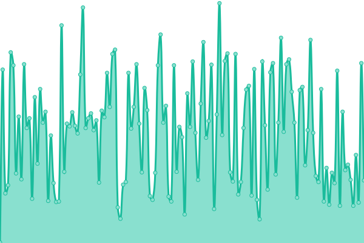 323ms
     
 | 

<a href="https://symapex.github.io/upsite/history/cleanaholic">100.00%</a>
    

|  [Tidy Cleaners](https://tidycleanerstx.com/) | 🟩 Up | [tidy-cleaners.yml](https://github.com/symapex/upsite/commits/HEAD/history/tidy-cleaners.yml) | 

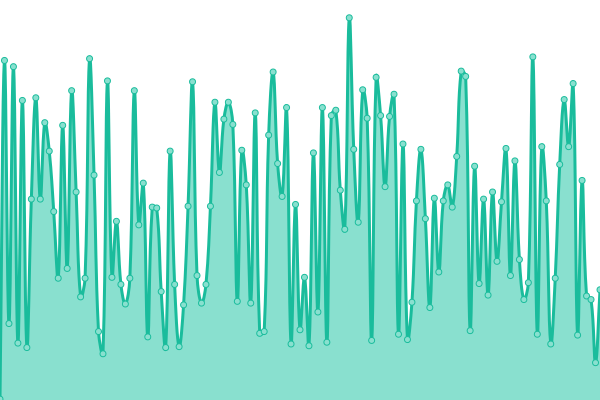 266ms
     
 | 

<a href="https://symapex.github.io/upsite/history/tidy-cleaners">100.00%</a>
    

|  [Cleanary Sandiego](https://cleanarysandiego.com/) | 🟩 Up | [cleanary-sandiego.yml](https://github.com/symapex/upsite/commits/HEAD/history/cleanary-sandiego.yml) | 

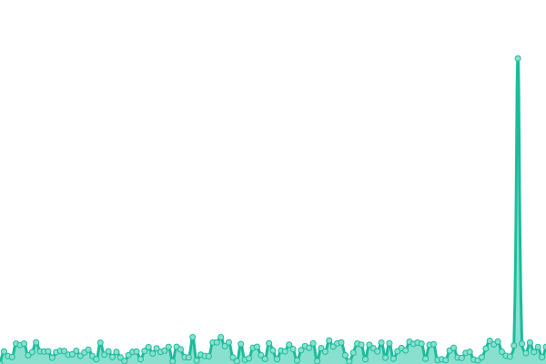 263ms
     
 | 

<a href="https://symapex.github.io/upsite/history/cleanary-sandiego">100.00%</a>
    

|  [Cleanwagon Ohio](https://cleanwagonohio.com/) | 🟩 Up | [cleanwagon-ohio.yml](https://github.com/symapex/upsite/commits/HEAD/history/cleanwagon-ohio.yml) | 

 323ms
     
 | 

<a href="https://symapex.github.io/upsite/history/cleanwagon-ohio">100.00%</a>
    

|  [Cleanasium](https://cleanasium.com/) | 🟩 Up | [cleanasium.yml](https://github.com/symapex/upsite/commits/HEAD/history/cleanasium.yml) | 

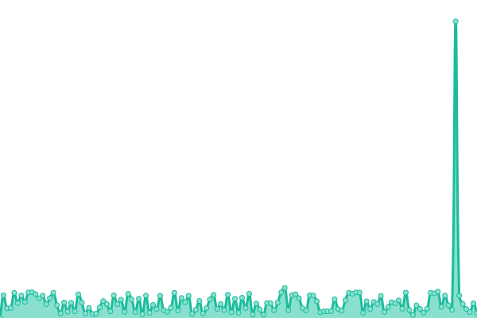 330ms
     
 | 

<a href="https://symapex.github.io/upsite/history/cleanasium">100.00%</a>
    

|  [Scrub Clean Seattle](https://scrubcleanseattle.com/) | 🟩 Up | [scrub-clean-seattle.yml](https://github.com/symapex/upsite/commits/HEAD/history/scrub-clean-seattle.yml) | 

 311ms
     
 | 

<a href="https://symapex.github.io/upsite/history/scrub-clean-seattle">100.00%</a>
    

|  [Clean Standards](https://clean-standards.com/) | 🟩 Up | [clean-standards.yml](https://github.com/symapex/upsite/commits/HEAD/history/clean-standards.yml) | 

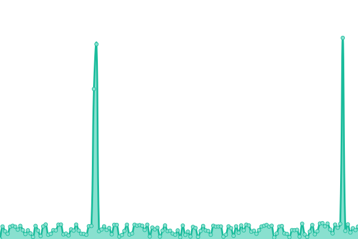 310ms
     
 | 

<a href="https://symapex.github.io/upsite/history/clean-standards">100.00%</a>
    

|  [Clean Wise](https://cleanwisenv.com/) | 🟩 Up | [clean-wise.yml](https://github.com/symapex/upsite/commits/HEAD/history/clean-wise.yml) | 

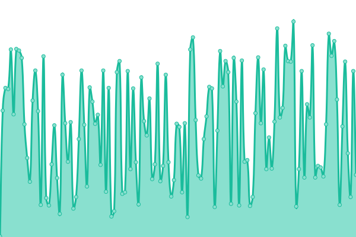 313ms
     
 | 

<a href="https://symapex.github.io/upsite/history/clean-wise">100.00%</a>
    

|  [Tidy Train Cleaners](https://tidytraincleaners.com/) | 🟩 Up | [tidy-train-cleaners.yml](https://github.com/symapex/upsite/commits/HEAD/history/tidy-train-cleaners.yml) | 

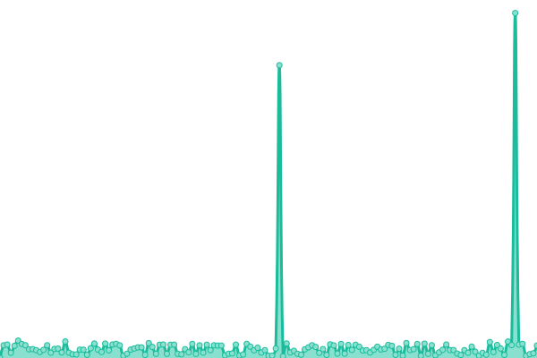 336ms
     
 | 

<a href="https://symapex.github.io/upsite/history/tidy-train-cleaners">100.00%</a>
    

|  [Clean Kind](https://cleankindphx.com/) | 🟩 Up | [clean-kind.yml](https://github.com/symapex/upsite/commits/HEAD/history/clean-kind.yml) | 

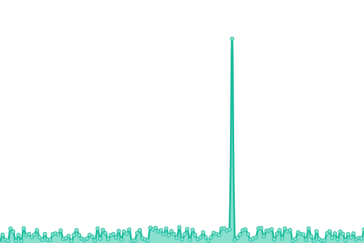 335ms
     
 | 

<a href="https://symapex.github.io/upsite/history/clean-kind">100.00%</a>
    

|  [Dragues Well Repair](https://dragueswellrepair.com/) | 🟩 Up | [dragues-well-repair.yml](https://github.com/symapex/upsite/commits/HEAD/history/dragues-well-repair.yml) | 

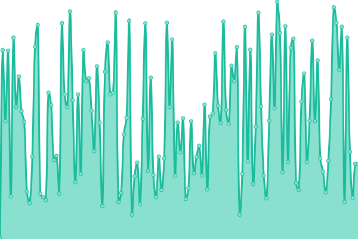 333ms
     
 | 

<a href="https://symapex.github.io/upsite/history/dragues-well-repair">100.00%</a>
    

|  [Well Repairman](https://wellrepairman.com/) | 🟩 Up | [well-repairman.yml](https://github.com/symapex/upsite/commits/HEAD/history/well-repairman.yml) | 

 1725ms
     
 | 

<a href="https://symapex.github.io/upsite/history/well-repairman">100.00%</a>
    

|  [Agati Well Repairs](https://agatiwellrepairs.com/) | 🟩 Up | [agati-well-repairs.yml](https://github.com/symapex/upsite/commits/HEAD/history/agati-well-repairs.yml) | 

 325ms
     
 | 

<a href="https://symapex.github.io/upsite/history/agati-well-repairs">100.00%</a>
    

|  [Sprint Fence](https://sprintfence.com/) | 🟩 Up | [sprint-fence.yml](https://github.com/symapex/upsite/commits/HEAD/history/sprint-fence.yml) | 

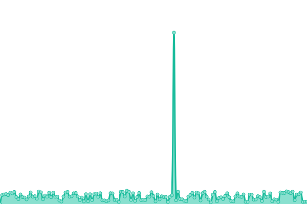 378ms
     
 | 

<a href="https://symapex.github.io/upsite/history/sprint-fence">100.00%</a>
    

|  [The Iron and Wood](https://theironandwood.com/) | 🟩 Up | [the-iron-and-wood.yml](https://github.com/symapex/upsite/commits/HEAD/history/the-iron-and-wood.yml) | 

 337ms
     
 | 

<a href="https://symapex.github.io/upsite/history/the-iron-and-wood">100.00%</a>
    

|  [Garden Gate Fence](https://gardengate-fence.com/) | 🟩 Up | [garden-gate-fence.yml](https://github.com/symapex/upsite/commits/HEAD/history/garden-gate-fence.yml) | 

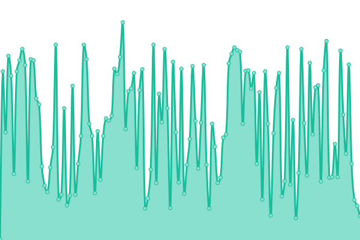 280ms
     
 | 

<a href="https://symapex.github.io/upsite/history/garden-gate-fence">100.00%</a>
    

|  [Brickyard Fence](https://brickyardfence.com/) | 🟩 Up | [brickyard-fence.yml](https://github.com/symapex/upsite/commits/HEAD/history/brickyard-fence.yml) | 

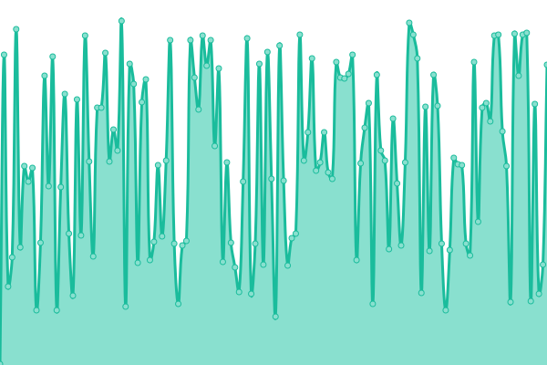 322ms
     
 | 

<a href="https://symapex.github.io/upsite/history/brickyard-fence">100.00%</a>
    

|  [Cedar Built Floors](https://cedarbuiltfloors.com/) | 🟩 Up | [cedar-built-floors.yml](https://github.com/symapex/upsite/commits/HEAD/history/cedar-built-floors.yml) | 

 268ms
     
 | 

<a href="https://symapex.github.io/upsite/history/cedar-built-floors">100.00%</a>
    

|  [Jacobs Floors](https://jacobsfloorstx.com/) | 🟩 Up | [jacobs-floors.yml](https://github.com/symapex/upsite/commits/HEAD/history/jacobs-floors.yml) | 

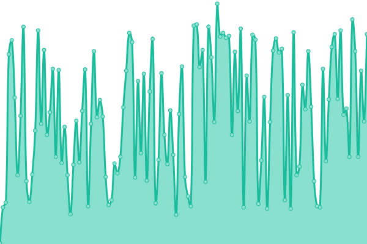 331ms
     
 | 

<a href="https://symapex.github.io/upsite/history/jacobs-floors">100.00%</a>
    

|  [Hammond Floors](https://hammondfloors.com/) | 🟩 Up | [hammond-floors.yml](https://github.com/symapex/upsite/commits/HEAD/history/hammond-floors.yml) | 

 354ms
     
 | 

<a href="https://symapex.github.io/upsite/history/hammond-floors">100.00%</a>
    

|  [Patio Pros Elpaso](https://patioproselpaso.com/) | 🟩 Up | [patio-pros-elpaso.yml](https://github.com/symapex/upsite/commits/HEAD/history/patio-pros-elpaso.yml) | 

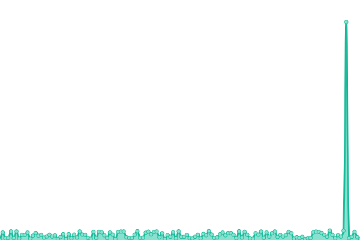 282ms
     
 | 

<a href="https://symapex.github.io/upsite/history/patio-pros-elpaso">100.00%</a>
    

|  [Boon Wood Flooring](https://boonwoodflooring.com/) | 🟩 Up | [boon-wood-flooring.yml](https://github.com/symapex/upsite/commits/HEAD/history/boon-wood-flooring.yml) | 

 318ms
     
 | 

<a href="https://symapex.github.io/upsite/history/boon-wood-flooring">100.00%</a>
    

|  [Pestero Bug Fortworth](https://pesterobugfortworth.com/) | 🟩 Up | [pestero-bug-fortworth.yml](https://github.com/symapex/upsite/commits/HEAD/history/pestero-bug-fortworth.yml) | 

 334ms
     
 | 

<a href="https://symapex.github.io/upsite/history/pestero-bug-fortworth">100.00%</a>
    

|  [Bugmode Pest Control](https://bugmodepestcontrol.com/) | 🟩 Up | [bugmode-pest-control.yml](https://github.com/symapex/upsite/commits/HEAD/history/bugmode-pest-control.yml) | 

 349ms
     
 | 

<a href="https://symapex.github.io/upsite/history/bugmode-pest-control">100.00%</a>
    

|  [Pest Busters](https://pestbustersnc.com/) | 🟩 Up | [pest-busters.yml](https://github.com/symapex/upsite/commits/HEAD/history/pest-busters.yml) | 

 335ms
     
 | 

<a href="https://symapex.github.io/upsite/history/pest-busters">100.00%</a>
    

|  [Crycket Pest Control](https://crycketpestcontrol.com/) | 🟩 Up | [crycket-pest-control.yml](https://github.com/symapex/upsite/commits/HEAD/history/crycket-pest-control.yml) | 

 317ms
     
 | 

<a href="https://symapex.github.io/upsite/history/crycket-pest-control">100.00%</a>
    

|  [Pest Scout Pros](https://pestscoutpros.com/) | 🟩 Up | [pest-scout-pros.yml](https://github.com/symapex/upsite/commits/HEAD/history/pest-scout-pros.yml) | 

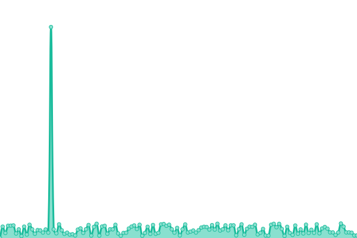 341ms
     
 | 

<a href="https://symapex.github.io/upsite/history/pest-scout-pros">100.00%</a>
    

|  [Carpetomatic](https://carpetomatic.com/) | 🟩 Up | [carpetomatic.yml](https://github.com/symapex/upsite/commits/HEAD/history/carpetomatic.yml) | 

 309ms
     
 | 

<a href="https://symapex.github.io/upsite/history/carpetomatic">100.00%</a>
    

|  [Cleanaroo](https://cleanaroonv.com/) | 🟩 Up | [cleanaroo.yml](https://github.com/symapex/upsite/commits/HEAD/history/cleanaroo.yml) | 

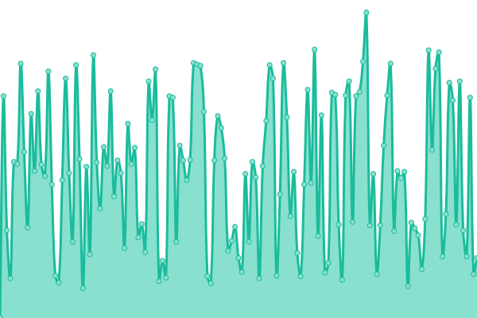 324ms
     
 | 

<a href="https://symapex.github.io/upsite/history/cleanaroo">100.00%</a>
    

|  [Scrubble Carpet Cleaners](https://srubblecarpetcleaners.com/) | 🟩 Up | [scrubble-carpet-cleaners.yml](https://github.com/symapex/upsite/commits/HEAD/history/scrubble-carpet-cleaners.yml) | 

 307ms
     
 | 

<a href="https://symapex.github.io/upsite/history/scrubble-carpet-cleaners">100.00%</a>
    

|  [True Word Translation](https://truewordtranslation.com/) | 🟩 Up | [true-word-translation.yml](https://github.com/symapex/upsite/commits/HEAD/history/true-word-translation.yml) | 

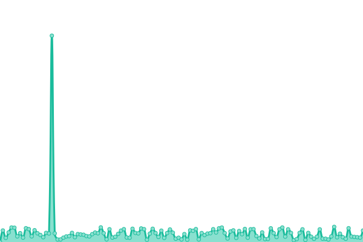 310ms
     
 | 

<a href="https://symapex.github.io/upsite/history/true-word-translation">100.00%</a>
    

|  [Global Translation](https://globaltranslationsrvs.com/) | 🟩 Up | [global-translation.yml](https://github.com/symapex/upsite/commits/HEAD/history/global-translation.yml) | 

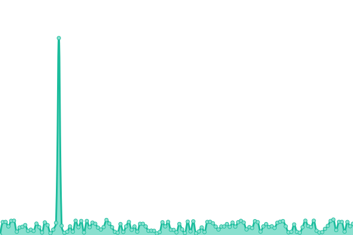 358ms
     
 | 

<a href="https://symapex.github.io/upsite/history/global-translation">100.00%</a>
    

|  [Simply Fluent](https://simply-fluent.com/) | 🟩 Up | [simply-fluent.yml](https://github.com/symapex/upsite/commits/HEAD/history/simply-fluent.yml) | 

 308ms
     
 | 

<a href="https://symapex.github.io/upsite/history/simply-fluent">100.00%</a>
    

|  [Catranslation Pros](http://catranslationpros.com/) | 🟩 Up | [catranslation-pros.yml](https://github.com/symapex/upsite/commits/HEAD/history/catranslation-pros.yml) | 

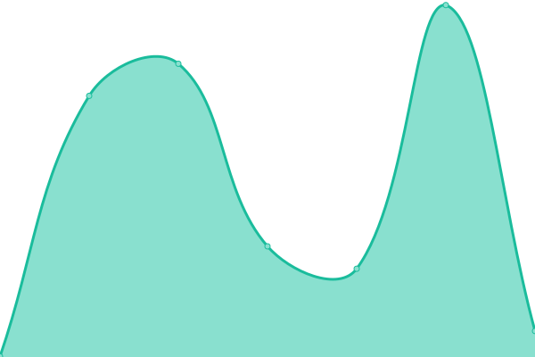 394ms
     
 | 

<a href="https://symapex.github.io/upsite/history/catranslation-pros">100.00%</a>
    

|  [Thrive Translation](http://thrivetranslation.com/) | 🟩 Up | [thrive-translation.yml](https://github.com/symapex/upsite/commits/HEAD/history/thrive-translation.yml) | 

 644ms
     
 | 

<a href="https://symapex.github.io/upsite/history/thrive-translation">100.00%</a>
    

|  [Marble Wood](https://marblewoodca.com/) | 🟩 Up | [marble-wood.yml](https://github.com/symapex/upsite/commits/HEAD/history/marble-wood.yml) | 

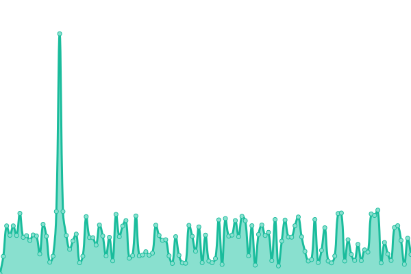 309ms
     
 | 

<a href="https://symapex.github.io/upsite/history/marble-wood">100.00%</a>
    

|  [Fresh Auto](https://fresh-auto.com/) | 🟩 Up | [fresh-auto.yml](https://github.com/symapex/upsite/commits/HEAD/history/fresh-auto.yml) | 

 322ms
     
 | 

<a href="https://symapex.github.io/upsite/history/fresh-auto">100.00%</a>
    

|  [Shiny Car Clean](https://shinycarclean.com/) | 🟩 Up | [shiny-car-clean.yml](https://github.com/symapex/upsite/commits/HEAD/history/shiny-car-clean.yml) | 

 319ms
     
 | 

<a href="https://symapex.github.io/upsite/history/shiny-car-clean">100.00%</a>
    

|  [Arborcare Ohio](https://arborcareohio.com/) | 🟩 Up | [arborcare-ohio.yml](https://github.com/symapex/upsite/commits/HEAD/history/arborcare-ohio.yml) | 

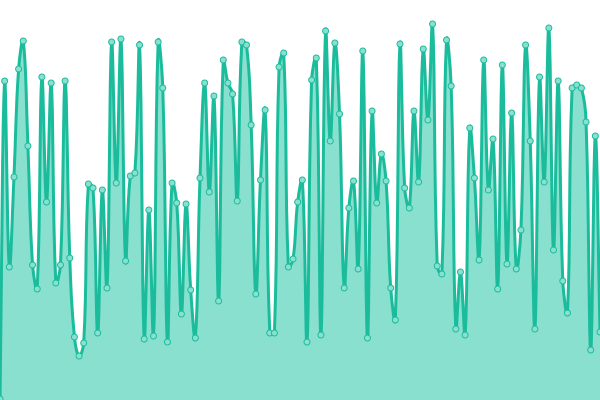 318ms
     
 | 

<a href="https://symapex.github.io/upsite/history/arborcare-ohio">100.00%</a>
    

|  [Everlast Deck](https://everlastdeck.com/) | 🟩 Up | [everlast-deck.yml](https://github.com/symapex/upsite/commits/HEAD/history/everlast-deck.yml) | 

 305ms
     
 | 

<a href="https://symapex.github.io/upsite/history/everlast-deck">100.00%</a>
    

|  [My Drywall Guy](https://my-drywall-guy.com/) | 🟩 Up | [my-drywall-guy.yml](https://github.com/symapex/upsite/commits/HEAD/history/my-drywall-guy.yml) | 

 327ms
     
 | 

<a href="https://symapex.github.io/upsite/history/my-drywall-guy">100.00%</a>
    

|  [Speedy Drywall](https://speedy-drywall.com/) | 🟩 Up | [speedy-drywall.yml](https://github.com/symapex/upsite/commits/HEAD/history/speedy-drywall.yml) | 

 329ms
     
 | 

<a href="https://symapex.github.io/upsite/history/speedy-drywall">100.00%</a>
    

|  [Mr Drywall TX](https://mrdrywalltx.com/) | 🟩 Up | [mr-drywall-tx.yml](https://github.com/symapex/upsite/commits/HEAD/history/mr-drywall-tx.yml) | 

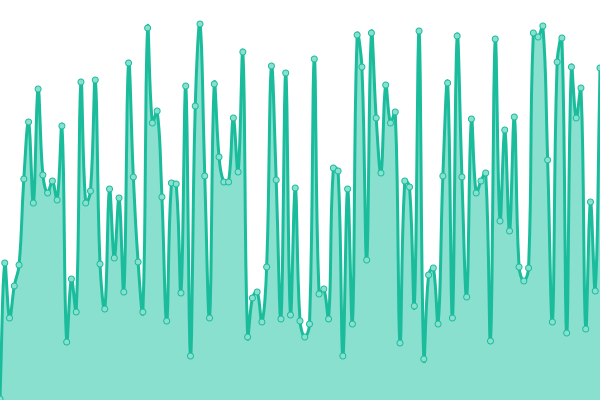 311ms
     
 | 

<a href="https://symapex.github.io/upsite/history/mr-drywall-tx">100.00%</a>
    

|  [Wall Doctor Denver](https://walldoctordenver.com/) | 🟩 Up | [wall-doctor-denver.yml](https://github.com/symapex/upsite/commits/HEAD/history/wall-doctor-denver.yml) | 

 318ms
     
 | 

<a href="https://symapex.github.io/upsite/history/wall-doctor-denver">100.00%</a>
    

|  [Speedy Auto Clean](https://speedyautoclean.com/) | 🟩 Up | [speedy-auto-clean.yml](https://github.com/symapex/upsite/commits/HEAD/history/speedy-auto-clean.yml) | 

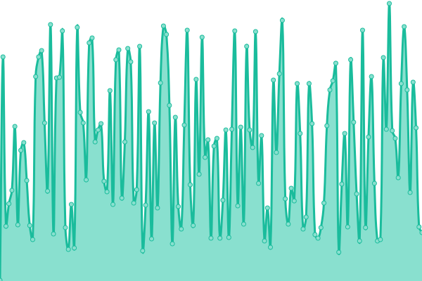 318ms
     
 | 

<a href="https://symapex.github.io/upsite/history/speedy-auto-clean">100.00%</a>
    

|  [Luxen Works](https://luxenworks.com/) | 🟩 Up | [luxen-works.yml](https://github.com/symapex/upsite/commits/HEAD/history/luxen-works.yml) | 

 4412ms
     
 | 

<a href="https://symapex.github.io/upsite/history/luxen-works">100.00%</a>
    

|  [Childrens Care AZ Website](http://childrenscareaz.org/) | 🟩 Up | [childrens-care-az-website.yml](https://github.com/symapex/upsite/commits/HEAD/history/childrens-care-az-website.yml) | 

 569ms
     
 | 

<a href="https://symapex.github.io/upsite/history/childrens-care-az-website">100.00%</a>
    

|  [Childrens Care AZ Backend](https://dev.childrenscareaz.org/) | 🟥 Down | [childrens-care-az-backend.yml](https://github.com/symapex/upsite/commits/HEAD/history/childrens-care-az-backend.yml) | 

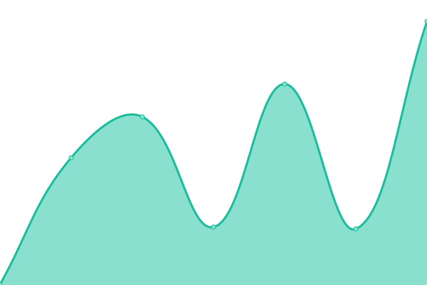 374ms
     
 | 

<a href="https://symapex.github.io/upsite/history/childrens-care-az-backend">21.13%</a>
    

|  [Task Take Out](https://tasktakeout.com/) | 🟩 Up | [task-take-out.yml](https://github.com/symapex/upsite/commits/HEAD/history/task-take-out.yml) | 

 1340ms
     
 | 

<a href="https://symapex.github.io/upsite/history/task-take-out">100.00%</a>
    

|  [Palm Valley Montessori](https://palmvalleymontessori.com/) | 🟩 Up | [palm-valley-montessori.yml](https://github.com/symapex/upsite/commits/HEAD/history/palm-valley-montessori.yml) | 

 1692ms
     
 | 

<a href="https://symapex.github.io/upsite/history/palm-valley-montessori">100.00%</a>
    

|  [Golferzen](https://golferzen.com/) | 🟩 Up | [golferzen.yml](https://github.com/symapex/upsite/commits/HEAD/history/golferzen.yml) | 

 339ms
     
 | 

<a href="https://symapex.github.io/upsite/history/golferzen">100.00%</a>
    

|  [Symplemarket](https://symplemarket.com/) | 🟩 Up | [symplemarket.yml](https://github.com/symapex/upsite/commits/HEAD/history/symplemarket.yml) | 

 313ms
     
 | 

<a href="https://symapex.github.io/upsite/history/symplemarket">67.80%</a>
    

|  [GMB Power](https://gmbpower.com/) | 🟩 Up | [gmb-power.yml](https://github.com/symapex/upsite/commits/HEAD/history/gmb-power.yml) | 

 2721ms
     
 | 

<a href="https://symapex.github.io/upsite/history/gmb-power">100.00%</a>
    

|  [Postcard Payments](https://postcardpayments.com/) | 🟩 Up | [postcard-payments.yml](https://github.com/symapex/upsite/commits/HEAD/history/postcard-payments.yml) | 

 345ms
     
 | 

<a href="https://symapex.github.io/upsite/history/postcard-payments">100.00%</a>
    

|  [Just Retribution](https://justretribution.com/) | 🟩 Up | [just-retribution.yml](https://github.com/symapex/upsite/commits/HEAD/history/just-retribution.yml) | 

 281ms
     
 | 

<a href="https://symapex.github.io/upsite/history/just-retribution">100.00%</a>
    

|  [Symple Market US](https://symplemarket.us/) | 🟩 Up | [symple-market-us.yml](https://github.com/symapex/upsite/commits/HEAD/history/symple-market-us.yml) | 

 265ms
     
 | 

<a href="https://symapex.github.io/upsite/history/symple-market-us">100.00%</a>
    

<!--end: status pages-->

[**Visit our status website →**](https://symapex.github.io/upsite)

## 📄 License

- Powered by: [Upptime](https://github.com/upptime/upptime)
- Code: [MIT](./LICENSE) © [symapex](https://symapex.github.io/upsite)
- Data in the `./history` directory: [Open Database License](https://opendatacommons.org/licenses/odbl/1-0/)
